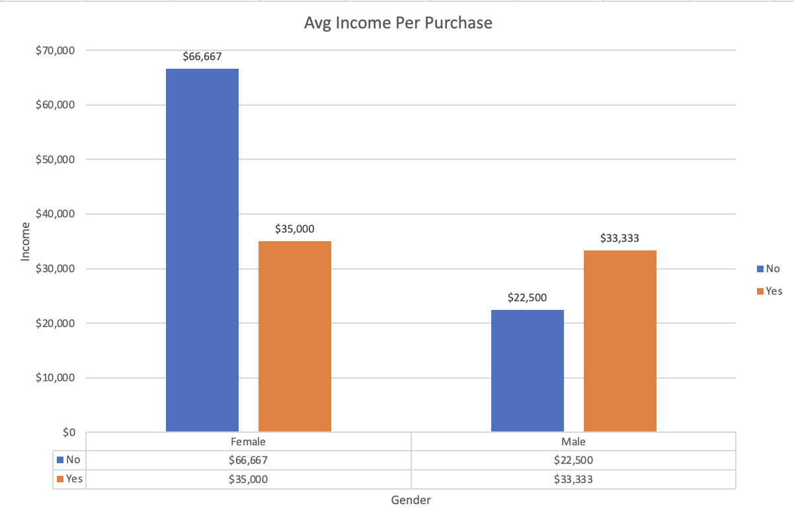
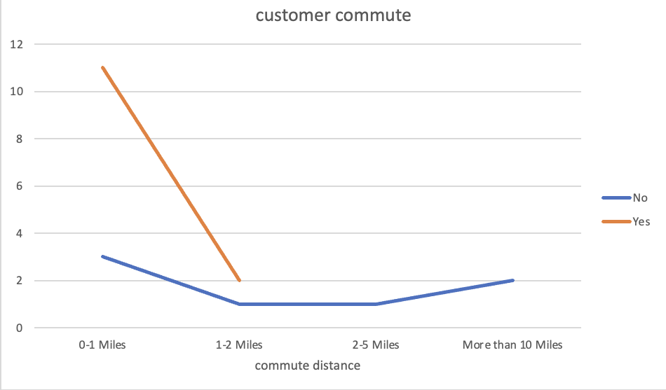
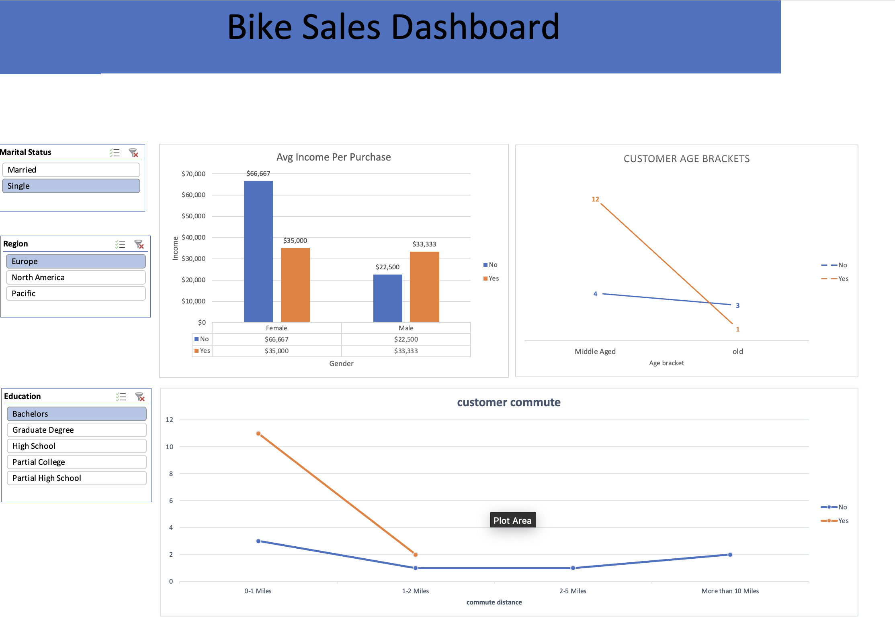

# Excel Sales Dashboard

## 📌 Overview
This project demonstrates how Excel can be used for business analytics by building an **interactive sales dashboard**. The dashboard provides insights into revenue trends, product performance, and regional sales distribution.

## 🛠 Tools & Techniques
- **Excel Functions**: VLOOKUP, PivotTables, PivotCharts  
- **Data Source**: `Sales.csv` (raw dataset)  
- **Data Cleaning**: Removing duplicates, handling nulls, formatting  
- **Visualization**: Bar charts, line charts, and KPIs using conditional formatting  
- **Interactivity**: Slicers for filtering by region, product, and time  

## 🔍 Key Features
- **Revenue Analysis**: Monthly sales trends and YoY comparison  
- **Top Products**: Identified high-performing product categories  
- **Regional Sales**: Visualized distribution of sales across regions  
- **KPIs**: Total Sales, Average Order Value, Top 5 Products  

## 📊 Dashboard Insights
- Seasonal spikes in sales identified during Q4  
- Top 20% of products contributed ~80% of sales revenue  
- Regional differences highlight expansion opportunities  

### 🔹 Sample Visuals
#### Avg Income per Purchase

#### Customer Commute

#### Full Dashboard

## 🚀 Results
- Delivered a **self-service Excel dashboard** for business stakeholders  
- Improved reporting efficiency using pivot automation  
- Supported better decision-making with visual sales insights  

## 📂 Files
- `data/Sales.csv` → Raw dataset  
- `data/Excel_Sales_Dashboard.xlsx` → Processed dashboard & analysis  
- `docs/Excel_Sales_Dashboard_Presentation.pptx` → Project presentation  
- `docs/` → Dashboard screenshots  

---

## 👤 Author
**Pawan Kalyan Ramisetty Narayanaswamy**  
🔗 [LinkedIn Profile](https://www.linkedin.com/in/pawan6/)  
📧 006pawank@gmail.com  
